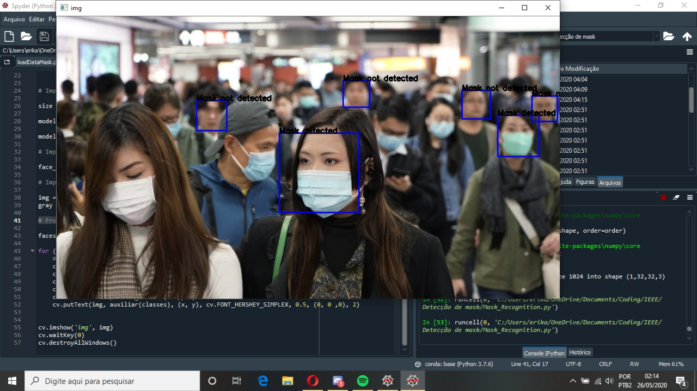

# Mask_Detection
Due to the worldwide pandemic, Covid-19, this project was created with the aim of analyzing whether people are respecting the use of masks.
This project has been done for IEEE-CS UFRN.

## Results

## Libraries Used
* OpenCV Haar Cacade
* TensorFlow/Keras Python

## Link for IEEE-CS UFRN
* https://gitlab.com/cs-ufrn/deteccao-mascaras/-/tree/master
